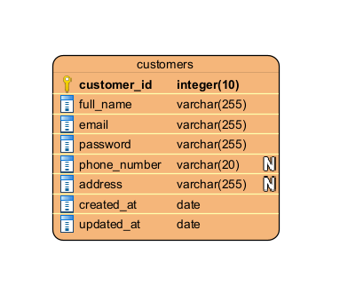
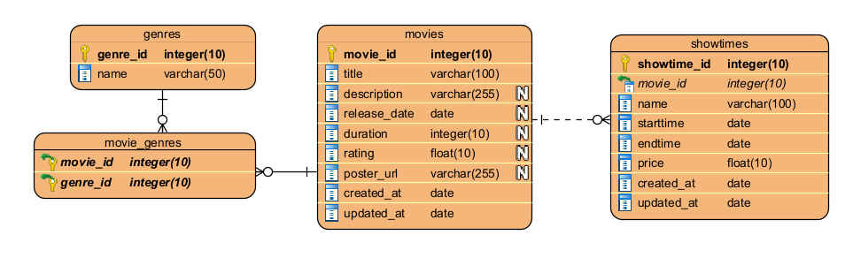
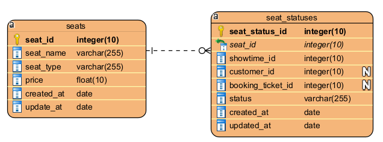
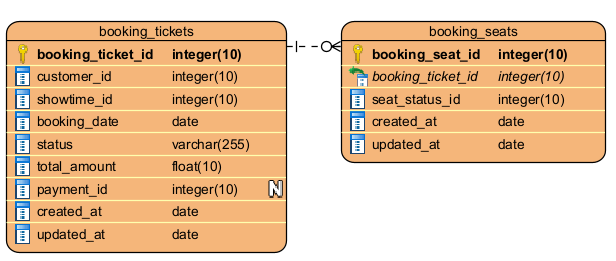
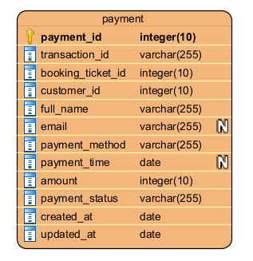
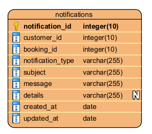
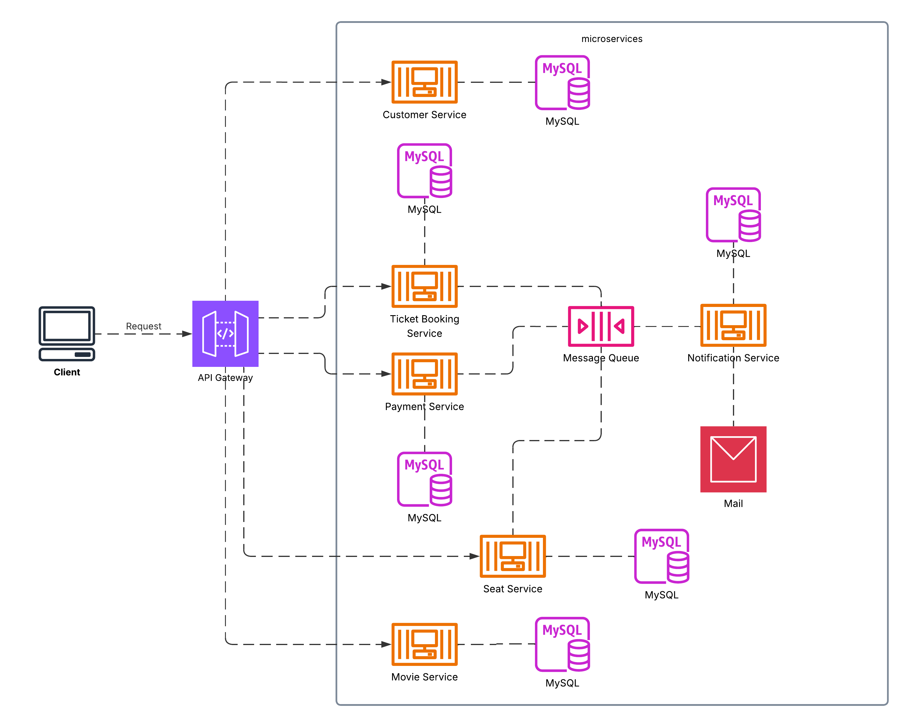

# 📊 Microservices System - Analysis and Design

This document outlines the **analysis** and **design** process for your microservices-based system assignment. Use it to explain your thinking and architecture decisions.

---

## 1. 🎯 Problem Statement

_Describe the problem your system is solving._

Hệ thống đặt vé xem phim cho phép khách hàng chọn phim, suất chiếu, ghế ngồi và tiến hành đặt vé trực tuyến. Sau khi khách hàng chọn phim, hệ thống sẽ kiểm tra tình trạng chỗ ngồi, xác minh thông tin vé, và xử lý thanh toán. Nếu đặt vé thành công, hệ thống sẽ gửi thông báo xác nhận vé đã đặt đến email của khách hàng.

Mô tả chi tiết các bước nghiệp vụ: 
1. Bắt đầu quy trình đặt vé: Khách hàng truy cập hệ thống và bắt đầu quy trình đặt vé xem phim. 
2. Chọn phim và suất chiếu: Khách hàng chọn phim muốn xem, cùng với suất chiếu và rạp phim cụ thể. 
3. Chọn ghế ngồi: Khách hàng chọn ghế ngồi từ danh sách các ghế còn trống. 
4. Nếu không còn ghế ngồi, kết thúc quy trình: Nếu ghế đã được đặt bởi người khác, hệ thống thông báo và dừng quy trình. 
5. Sau khi chọn ghế ngồi, nhập thông tin khách hàng: Khách hàng cung cấp các thông tin cá nhân như họ tên, số điện thoại và email. 
6. Trước khi chuyển đến bước thanh toán: Hệ thống tạo hóa đơn mới với trạng thái pending, cập nhật trạng thái ghế được chọn thành đang giữ chỗ.
7. Thanh toán: Khách hàng tiến hành thanh toán trực tuyến thông qua các cổng thanh toán. 
8. Gửi thông báo: Nếu giao dịch thành công hoặc thất bại, hệ thống gửi thông báo đến email của khách hàng. 
10. Cập nhật tình trạng ghế ngồi: Hệ thống cập nhật tình trạng ghế đã được đặt vào cơ sở dữ liệu. 
11. Cập nhật thông tin vé vào cơ sở dữ liệu. 

## 2. 🧩 Identified Microservices

List the microservices in your system and their responsibilities.

| Service Name  | Responsibility                                | Tech Stack   |
|---------------|------------------------------------------------|--------------|
|ticket booking service|  Quản lý hóa đơn đặt vé xem phim của khách hàng.| FastAPI (Python), Docker, Docker Compose, MySQL |
|movie service |  Quản lý thông tin về phim và suất chiếu của phim.| FastAPI (Python), Docker, Docker Compose, MySQL |
|customer service |  Quản lý thông tin khách hàng và xác minh đăng nhập.| FastAPI (Python), Docker, Docker Compose, MySQL|
|payment service | Quản lý việc xử lý thanh toán vé xem phim trực tuyến. | FastAPI (Python),Docker, Docker Compose, RabbitMQ, MySQL |
|seat service| Quản lý thông tin ghế ngồi và tình trạng ghế ngồi của các suất chiếu.|FastAPI (Python), Docker, Docker Compose, RabbitMQ, MySQL|
|notification service|Gửi email thông báo đặt vé đến khách hàng sau khi thanh toán thành công hoặc thất bại.|FastAPI (Python), Docker, Docker Compose, SMTP, RabbitMQ, MySQL|
|booking-ticket-app| Giao diện hệ thống đặt vé xem phim.|Next.js, React, JavaScript, Docker, Docker Compose|
|Gateway| Điều hướng request đến các service|Java Spring Boot, JWT, Docker, Docker Compose|

---

## 3. 🔄 Service Communication

Describe how your services communicate (e.g., REST APIs, message queue, gRPC).

- Gateway ⇄ ticket booking service (REST)
- Gateway ⇄ movie service (REST)
- Gateway ⇄ customer service (REST)
- Gateway ⇄ payment service (REST)
- Gateway ⇄ seat service (REST)
- Gateway ⇄ notification service (REST)
- Internal: ticket booking service ⇄ seat service (REST, RabbitMQ)
- Internal: ticket booking service ⇄ payment service (REST, RabbitMQ)
- Internal: ticket booking service ⇄ customer service (REST)
- Internal: ticket booking service ⇄ movie service (REST)
- Internal: payment service ⇄ seat service (RabbitMQ)
- Internal: payment service ⇄ notification service (RabbitMQ)

---

## 4. 🗂️ Data Design

Describe how data is structured and stored in each service.

- customer_service: customers
- movie_service: movies, genres, movie_genres,showtimes
- seat_service: seats, seat_statuses
- ticket_booking_service: booking_ticket, seat_ticket
- payment_service: payment
- notification_service: notification

### Ảnh diagram ERD của customer_service:

---

### Ảnh diagram ERD của movie_service:

---

### Ảnh diagram ERD của seat_service:

---

### Ảnh diagram ERD của ticket_booking_service:

---

### Ảnh diagram ERD của payment_service:

---

### Ảnh diagram ERD của notification_service:

---

## 5. 🔐 Security Considerations

- Use JWT for user sessions:

Gateway đóng vai trò làm cổng bảo vệ đầu vào cho hệ thống, chịu trách nhiệm xác thực người dùng và kiểm soát truy cập thông qua cơ chế JWT (JSON Web Token). Khi người dùng thực hiện đăng nhập, hệ thống kiểm tra thông tin tài khoản và tạo ra một JWT chứa các thông tin định danh, cùng với thời gian phát hành và thời gian hết hạn. Token này sẽ được trả về cho client và sử dụng trong các request tiếp theo. Gateway sẽ kiểm tra token ở mỗi request, đảm bảo chỉ người dùng đã xác thực mới được phép truy cập tài nguyên.

---

## 6. 📦 Deployment Plan

Hệ thống được triển khai bằng Docker, sử dụng docker-compose để quản lý toàn bộ các service một cách đồng bộ. Mỗi service chạy độc lập trong container riêng, giao tiếp với nhau thông qua mạng nội bộ (docker network).

Các biến môi trường được lưu trong file `.env` của từng service.

---

## 7. 🎨 Architecture Diagram

> *(You can add an image or ASCII diagram below)*

---

## ✅ Summary

Kiến trúc hệ thống được thiết kế dựa trên mô hình microservices, cho phép chia nhỏ chức năng thành các dịch vụ độc lập như: customer_service, movie_service, seat_service, ticket_booking_service, payment_service, notification_service. Mỗi service có thể phát triển, triển khai và mở rộng riêng biệt, giúp tăng tính linh hoạt và dễ bảo trì.

Cổng vào hệ thống là Gateway, đóng vai trò xác thực người dùng thông qua cơ chế JWT và điều phối các request đến từng dịch vụ tương ứng. Dữ liệu của từng service được thiết kế riêng biệt và tối ưu.

Hệ thống được triển khai thông qua Docker và quản lý bằng Docker Compose, giúp dễ dàng tái tạo môi trường phát triển và triển khai đồng bộ. Với thiết kế này, hệ thống có khả năng mở rộng tốt, hỗ trợ phát triển song song nhiều team và đáp ứng yêu cầu vận hành trong môi trường thực tế.

